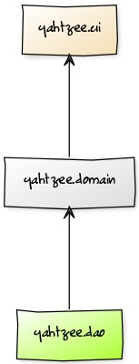
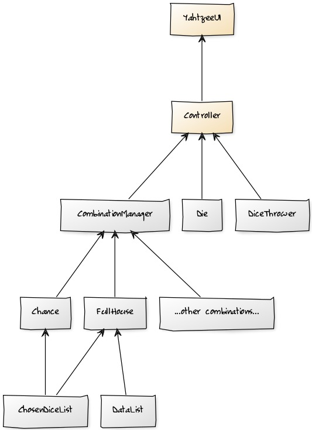
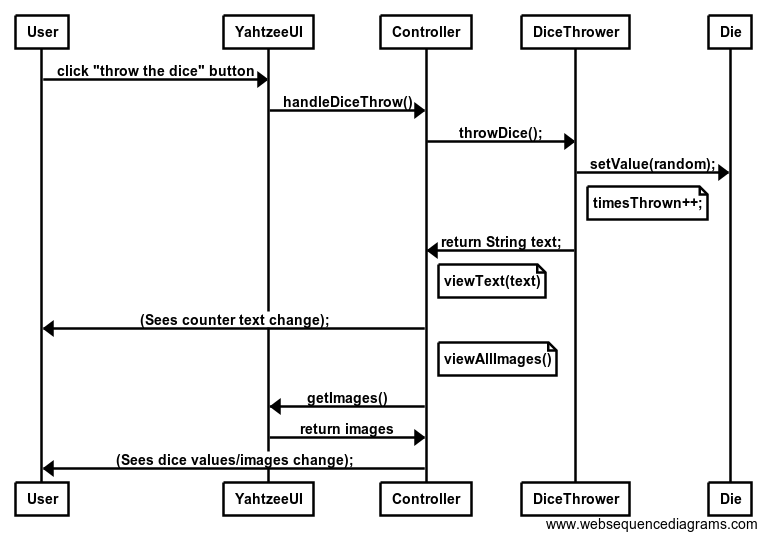
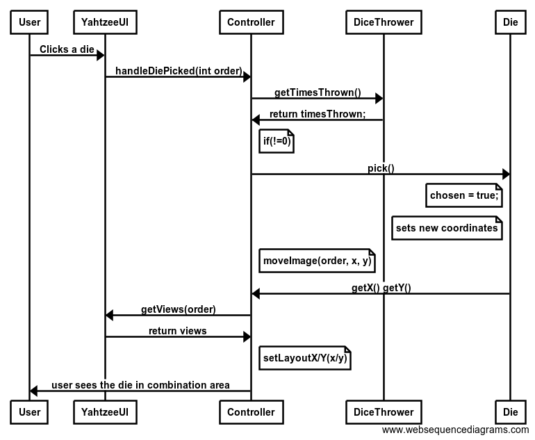
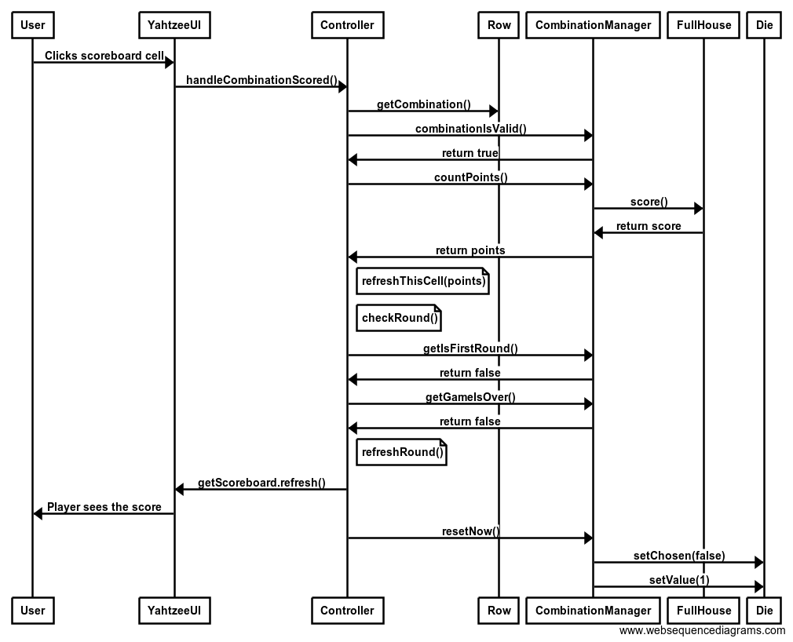

<h1>Arkkitehtuurikuvaus</h1>

<h2>Rakenne</h2>

Alla olevassa kaaviossa on kuvattu ohjelman pakkausrakenne, joka koostuu käyttöliittymästä (yahtzee.ui), logiikasta
(yahtzee.domain), sekä mahdollisesti myöhemmin lisättävästä tietokannan kanssa kommunikoivasta pakkauksesta 
(yahtzee.dao).

<h2>Sovelluslogiikka</h2>

Alla olevassa kaaviossa on kuvattu ohjelman luokkakaavio, joka koostuu käyttöliittymäluokasta YahtzeeUI, noppien
arvoja ja niihin liittyviä kuvia käsittelevästä luokasta Die, noppien heittoa käsittelevästä luokasta DiceThrower
sekä toistaiseksi puuttuvasta luokasta Combination, joka tulee käsittelemään kombinaatioiden pisteytystä, jonka
toisaalta voisi vaihtoehtoisesti toteuttaa monena luokkana eri kombinaatioita varten. Keltainen tausta tarkoittaa,
että luokka sisältyy pakkaukseen yahtzee.ui, valkoinen puolestaan pakkaukseen yahtzee.domain ja vihreä yahtzee.dao.
Projekti sisältää toki myös muita luokkia, mutta ne eivät ole oleellisia sovelluslogiikan näkökulmasta.

 
 
 <h2>Päätoiminnallisuudet</h2>
 
 <h3>Noppien heitto</h3>
 
  
 Alla olevan kuvan mukaisesti noppien heitto alkaa, kun käyttäjä painaa "Throw the dice" nappia.
 Käyttöliittymäluokan even handler sitten kutsuu Controllerin handleDiceThrow() -metodia, joka vie puolestaan
 sovelluslogiikan puolelle DiceThrower -luokan throwDice() -metodiin. Mikäli noppia ei olla vielä heitetty
 kolmesti, jatketaan tutkimaan onko noppia heitetty vielä kertaakaan. Jos noppia ei olla vielä heitetty niin
 kaikki nopat asetetaan ei-valituiksi Die -luokan setChosen -metodilla (ei kuvassa). Sitten ei valittujen noppien
 setValue() metodia kutsutaan parametrinaan arvottu luku 1-6, jonka jälkeen timesThrown -muuttujaa kasvatetaan.
 Heittojen määrän kertova teksti palautetaan Controllerille, joka suorittaa oman viewText -metodinsa näyttääkseen
 tekstin ruudulla, jolloin käyttäjä näkee tekstin. Sitten Controller käyttää viewAllImages -metodia, joka kutsuu
 joka kuvalle viewImage -metodia, jossa ImageView haetaan mainista ja sen kuvaa muutetaan vastaamaan uutta nopan
 silmälukua, jolloin käyttäjä näkee nopan silmäluvun muuttuneen.
 
 
 
 <h3>Nopan valinta</h3>
 
 Käyttäjä klikkaa valitsemaansa noppaa hiirellä, jolloin YahtzeeUI:ssa event handler kutsuu Controllerin
 handleDiePicked() -metodia, joka puolestaan ensin kutsuu DiceThrower:in getTimesThrown -metodia varmistaakseen,
 että noppia on heitetty vähintään kerran ennen noppien valitsemista. Sen jälkeen Controller kutsuu noppaa
 vastaavan Die -olion pick() -metodia. Tämä asettaa olion chosen -muuttujan arvoksi true valinnan merkiksi ja myös
 asettaa x, y -koordinaatit kombinaatioalueen koordinaateiksi. Sitten Controller käyttää metodiaan
 moveImage(order, x, y), joka hakee käyttöliittymäluokasta order -lukua vastaavan ImageView:n ja 
 muuttaa sen x ja y koordinaatit Die -olion vastaaviksi Die:n gettereiden perusteella, jolloin käyttäjä voi nähdä
 nopan siirtyneen heittoalueelta kombinaatioalueelle.
 
  
  
 <h3>Kombinaation pisteytys</h3>
 
 Kombinaation pisteytys alkaa, kun käyttäjä klikkaa tulostaulun jotain solua. EventHandler käyttöliittymäluokassa
 tällöin kutsuu Controllerin handleCombinationScored() -metodia. Klikatusta rivistä tehdään Row -olio (ei kuvassa),
 josta sitten haetaan valitun kombinaation nimi getCombination() -metodilla ja tarkastetaan, että kombinaatio
 voidaan pisteyttää kutsumalla CombinationManagerin combinationIsValid -metodia, joka palauttaa esimerkissä true.
 Sitten kutsutaan CombinationManagerin countPoints() metodia, joka taas kutsuu kombinaatiota vastaavaa pisteitä
 laskevaa luokkaa, esimerkissämme FullHouse eli täyskäsi. Pisteet palautetaan CombinationManagerin kautta 
 Controlleriin, jossa taulukon solun arvo päivitetään oikeaksi. Sitten ajetaan checkRound() -metodi, joka 
 tarkistaa combinationManagerin getIsFirstRound() ja getGameIsOver -gettereiden avulla, että ollaan toisella
 kierroksella, mutta peli ei ole loppunut vielä. refreshRound() -metodi kutsuu käyttöliittymäluokan taulukkoa
 päivittymään, jolloin käyttäjä näkee taulukossa oikean arvon. Sitten kutsutaan vielä CombinationManagerin
 resetNow() -metodia, joka kutsuu Die -luokan settereitä asettamaan jokaisen nopan arvoksi yksi ja tilaksi
 false eli ei-valittu. 
 
  
