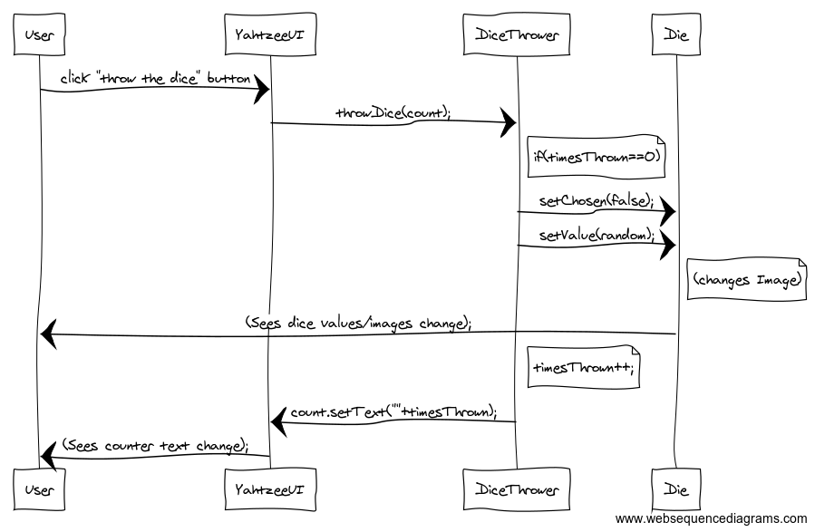
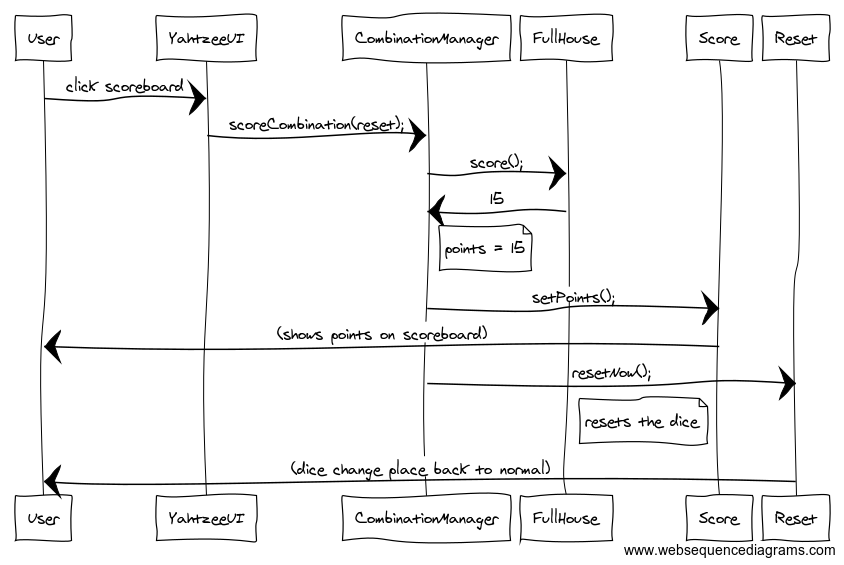

<h1>Arkkitehtuurikuvaus</h1>

<h2>Rakenne</h2>

Alla olevassa kaaviossa on kuvattu ohjelman pakkausrakenne, joka koostuu käyttöliittymästä (yahtzee.ui), logiikasta
(yahtzee.domain), sekä mahdollisesti myöhemmin lisättävästä tietokannan kanssa kommunikoivasta pakkauksesta 
(yahtzee.dao).

<h2>Sovelluslogiikka</h2>

Alla olevassa kaaviossa on kuvattu ohjelman luokkakaavio, joka koostuu käyttöliittymäluokasta YahtzeeUI, noppien
arvoja ja niihin liittyviä kuvia käsittelevästä luokasta Die, noppien heittoa käsittelevästä luokasta DiceThrower
sekä toistaiseksi puuttuvasta luokasta Combination, joka tulee käsittelemään kombinaatioiden pisteytystä, jonka
toisaalta voisi vaihtoehtoisesti toteuttaa monena luokkana eri kombinaatioita varten. Keltainen tausta tarkoittaa,
että luokka sisältyy pakkaukseen yahtzee.ui, valkoinen puolestaan pakkaukseen yahtzee.domain ja vihreä yahtzee.dao.
Projekti sisältää toki myös muita luokkia, mutta ne eivät ole oleellisia sovelluslogiikan näkökulmasta.

 
 
 <h2>Päätoiminnallisuudet</h2>
 
 <h3>Noppien heitto</h3>
 
 Alla olevan kuvan mukaisesti noppien heitto alkaa 
 
 
 
 test
 
 <h3>Kombinaation pisteytys</3>
 
  
