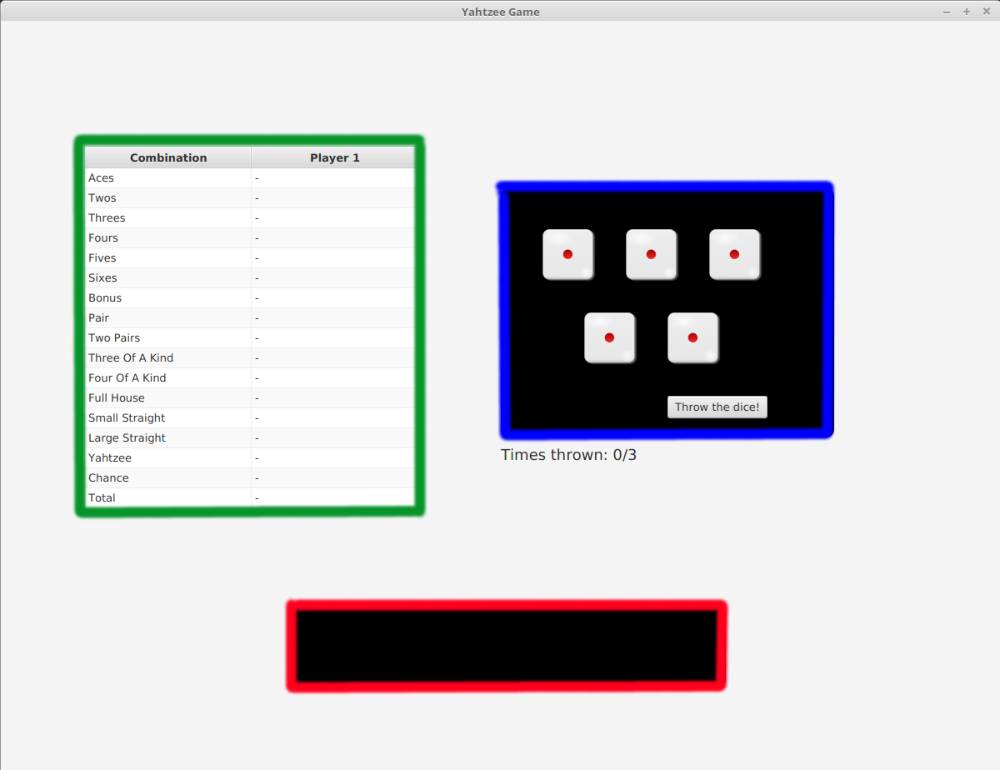
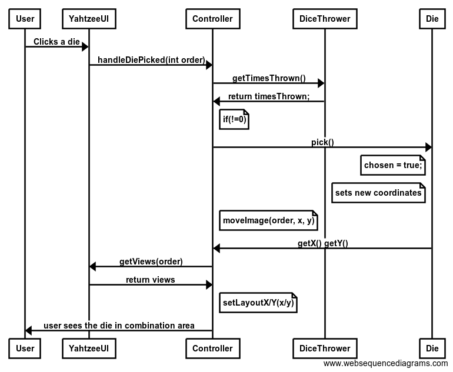

<h1>Arkkitehtuurikuvaus</h1>

<h2>Rakenne</h2>

Alla olevassa kaaviossa on kuvattu ohjelman pakkausrakenne, joka koostuu käyttöliittymästä (yahtzee.ui), logiikasta
(yahtzee.domain), sekä mahdollisesti myöhemmin lisättävästä tietokannan kanssa kommunikoivasta pakkauksesta 
(yahtzee.dao).

<h2>Käyttöliittymä</h2>

Käyttöliittymä sovelluksessa jakautuu kolmeen ikkunaan: pelilauta, nimimerkin valinta ja ennätykset. 

Pelilauta jakautuu
heittoalueeseen (ympyröity sinisellä), kombinaatioalueeseen (ympyröity punaisella) ja tulostauluun (ympyröity
vihreällä). Heittoalueen painiketta painamalla heitetään noppia ja sen alla on laskuri jäljellä olevista heitoista.
Noppia klikkaamalla ne liikkuvat kombinaatioalueelle, joihin kombinaatiot muodostetaan. Tulostaulun riviä
klikkaamalla rivin mukainen kombinaatio pisteytetään, laskuri nollataan ja uusi kierros alkaa. 

Nimimerkin valinta -ikkuna avautuu pelin päätteeksi mikäli pelaaja on päässyt kymmenen parhaan joukkoon. Tässä
ikkunassa yksinkertaisesti valitaan nimimerkki kirjoittamalla se tekstikenttään ja painamalla "Show Highscores" 
-nappia, joka avaa ennätykset.

Ennätysvalikko avautuu jokaisen pelin jälkeen. Se kertoo pelaajan pistemäärän ja näyttää taulukossa paikallisen
top 10 -listan, eli ennätykset. Ikkunan alla olevista painikkeista voi aloittaa uuden pelin tai sulkea pelin.

<h2>Sovelluslogiikka</h2>

Alla olevassa kaaviossa on kuvattu ohjelman luokkakaavio. Sen perustana on käyttöliittymäluokka YahtzeeUI. 
Controller -luokan tehtävänä on toimia liitoskappaleena käyttöliittymän ja sovelluslogiikan välillä ja se kutsuu
sovellusluokkien metodeja silloin, jos käyttöliittymäluokan tapahtumakäsittelijät eli event handlerit ilmoittavat
tapahtumasta. 

Sovelluslogiikan olennaisimmat luokat ovat noppien arvoja ja tiloja käsittelevä luokka Die, noppien heittoa
käsittelevä luokka DiceThrower, sekä CombinationManager, joka hallinnoi kombinaatioiden pisteytystä ja niiiden
rajoituksia. 

CombinationManager sisältää oliot kaikista eri kombinaatiotyypeistä, joihin kombinaatiot jakautuvat. Kombinaatioluokkien tehtävä on siis laskea kyseisen kombinaation tuottamat pisteet. 
Osaa kombinaatioluokista tukee luokka InstanceList, joka tarjoaa dataa saman arvon ilmentymistä noppien joukossa,
esim. onko noppien joukossa kolmen saman joukkoa, ja mitä arvoa ne ovat (kuutosia?, kolmosia?..). Huomaa, että
kombinaatiot jaetaan neljään päätyyppiin, joista on omat luokkansa, esim. sekä sattuma (chance) että kolmoset 
(threes) ovat SumCombination olioita, sillä molempien perusperiaate on pisteyttää noppien summa tietyllä ehdolla.
Kombinaatiotyypit joihin kombinaatiot jakautuvat ovat SumCombination, XOfAKind, Straight ja niiden ulkopuolelle
jää FullHouse, joka on eriytetty XOfAKind:sta, sillä sen ehdot ovat liian poikkeavat toteutettavaksi samaan 
luokkaan.

Controller toimii myös liitoskappaleena Dao -luokkien ja käyttöliittymän välillä. HighscoresDao hallinnoi
tietokantoja ja se käyttää apunaan ennätyksen abstraktoivaa luokkaa Highscore ja Database luokkaa, jossa on
tietokannan osoite. Tietokantaan siis tallennetaan ennätystuloksia.

Keltainen tausta tarkoittaa, että luokka sisältyy pakkaukseen yahtzee.ui, valkoinen puolestaan pakkaukseen yahtzee.domain ja vihreä yahtzee.dao.

 
 
 <h2>Päätoiminnallisuudet</h2>
 
 <h3>Noppien heitto</h3>
 
  
 Alla olevan kuvan mukaisesti noppien heitto alkaa, kun käyttäjä painaa "Throw the dice" nappia.
 Käyttöliittymäluokan even handler sitten kutsuu Controllerin handleDiceThrow() -metodia, joka vie puolestaan
 sovelluslogiikan puolelle DiceThrower -luokan throwDice() -metodiin. Mikäli noppia ei olla vielä heitetty
 kolmesti, jatketaan tutkimaan onko noppia heitetty vielä kertaakaan. Jos noppia ei olla vielä heitetty niin
 kaikki nopat asetetaan ei-valituiksi Die -luokan setChosen -metodilla (ei kuvassa). Sitten ei valittujen noppien
 setValue() metodia kutsutaan parametrinaan arvottu luku 1-6, jonka jälkeen timesThrown -muuttujaa kasvatetaan.
 Heittojen määrän kertova teksti palautetaan Controllerille, joka suorittaa oman viewText -metodinsa näyttääkseen
 tekstin ruudulla, jolloin käyttäjä näkee tekstin. Sitten Controller käyttää viewAllImages -metodia, joka kutsuu
 joka kuvalle viewImage -metodia, jossa ImageView haetaan mainista ja sen kuvaa muutetaan vastaamaan uutta nopan
 silmälukua, jolloin käyttäjä näkee nopan silmäluvun muuttuneen.
 
 
 
 <h3>Nopan valinta</h3>
 
 Käyttäjä klikkaa valitsemaansa noppaa hiirellä, jolloin YahtzeeUI:ssa event handler kutsuu Controllerin
 handleDiePicked() -metodia, joka puolestaan ensin kutsuu DiceThrower:in getTimesThrown -metodia varmistaakseen,
 että noppia on heitetty vähintään kerran ennen noppien valitsemista. Sen jälkeen Controller kutsuu noppaa
 vastaavan Die -olion pick() -metodia. Tämä asettaa olion chosen -muuttujan arvoksi true valinnan merkiksi ja myös
 asettaa x, y -koordinaatit kombinaatioalueen koordinaateiksi. Sitten Controller käyttää metodiaan
 moveImage(order, x, y), joka hakee käyttöliittymäluokasta order -lukua vastaavan ImageView:n ja 
 muuttaa sen x ja y koordinaatit Die -olion vastaaviksi Die:n gettereiden perusteella, jolloin käyttäjä voi nähdä
 nopan siirtyneen heittoalueelta kombinaatioalueelle.
 
  
  
 <h3>Kombinaation pisteytys</h3>
 
 Kombinaation pisteytys alkaa, kun käyttäjä klikkaa tulostaulun jotain solua. EventHandler käyttöliittymäluokassa
 tällöin kutsuu Controllerin handleCombinationScored() -metodia. Klikatusta rivistä tehdään Row -olio (ei kuvassa),
 josta sitten haetaan valitun kombinaation nimi getCombination() -metodilla ja tarkastetaan, että kombinaatio
 voidaan pisteyttää kutsumalla CombinationManagerin combinationIsValid -metodia, joka palauttaa esimerkissä true.
 Sitten kutsutaan CombinationManagerin countPoints() metodia, joka taas kutsuu kombinaatiota vastaavaa pisteitä
 laskevaa luokkaa, esimerkissämme FullHouse eli täyskäsi. Pisteet palautetaan CombinationManagerin kautta 
 Controlleriin, jossa taulukon solun arvo päivitetään oikeaksi. Sitten ajetaan checkRound() -metodi, joka 
 tarkistaa combinationManagerin getIsFirstRound() ja getGameIsOver -gettereiden avulla, että ollaan toisella
 kierroksella, mutta peli ei ole loppunut vielä. refreshRound() -metodi kutsuu käyttöliittymäluokan taulukkoa
 päivittymään, jolloin käyttäjä näkee taulukossa oikean arvon. Sitten kutsutaan vielä CombinationManagerin
 resetNow() -metodia, joka kutsuu Die -luokan settereitä asettamaan jokaisen nopan arvoksi yksi ja tilaksi
 false eli ei-valittu. 
 
  
