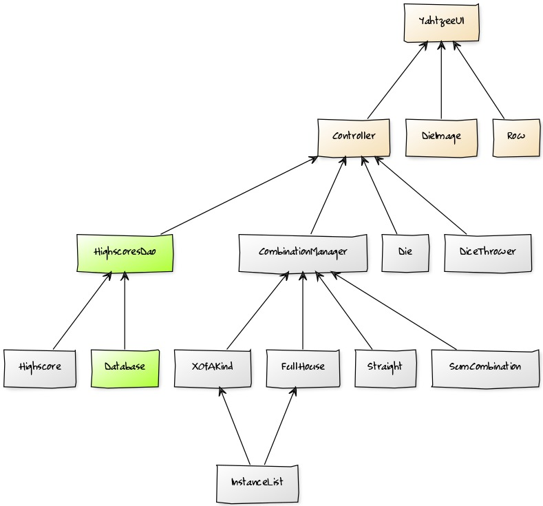

<h1>Arkkitehtuurikuvaus</h1>

<h2>Rakenne</h2>

Alla olevassa kaaviossa on kuvattu ohjelman pakkausrakenne, joka koostuu käyttöliittymästä (yahtzee.ui), logiikasta
(yahtzee.domain), sekä mahdollisesti myöhemmin lisättävästä tietokannan kanssa kommunikoivasta pakkauksesta 
(yahtzee.dao).

<h2>Sovelluslogiikka</h2>

Alla olevassa kaaviossa on kuvattu ohjelman luokkakaavio, joka koostuu käyttöliittymäluokasta YahtzeeUI, noppien
arvoja ja niihin liittyviä kuvia käsittelevästä luokasta Die, noppien heittoa käsittelevästä luokasta DiceThrower
sekä toistaiseksi puuttuvasta luokasta Combination, joka tulee käsittelemään kombinaatioiden pisteytystä, jonka
toisaalta voisi vaihtoehtoisesti toteuttaa monena luokkana eri kombinaatioita varten. Keltainen tausta tarkoittaa,
että luokka sisältyy pakkaukseen yahtzee.ui, valkoinen puolestaan pakkaukseen yahtzee.domain ja vihreä yahtzee.dao.
Projekti sisältää toki myös muita luokkia, mutta ne eivät ole oleellisia sovelluslogiikan näkökulmasta.

 
 
 <h2>Päätoiminnallisuudet</h2>
 
 <h3>Noppien heitto</h3>
 
 Alla olevan kuvan mukaisesti noppien heitto alkaa, kun käyttäjä painaa "Throw the dice" nappia.
 Käyttöliittymäluokan
 event handler sitten kutsuu DiceThrower luokan throwDice(Label) metodia, johon annetaan Label count, jossa on
 ilmoitettu käyttäjälle tekstinä tällä vuorolla tehtyjen heittojen määrä ja maksimin (3 heittoa) lukumäärä. 
 Mikäli DiceThrower olion timesThrown metodi on nolla, eli kyseessä on kierroksen ensimmäinen heitto, niin se
 palauttaa nopat yksi kerrallaan takaisin valittaviksi kutsumalla Die -luokan metodia setChosen() parametrilla
 false.
 Sitten DiceThrower kutsuu kaikille ei-valituille nopille Die -luokan metodia setValue() metodia parametrinaan
 arvottu luku 1-6. Kyseinen metodi vaihtaa uuden arvon perusteella nopan silmälukua ja asettaa nopalle silmälukua
 vastaavan kuvan, jolloin käyttäjä näkee nopan silmäluvun vaihtuneen. Sitten DiceThrower lisää muuttujaansa 
 timesThrown yhdellä, jotta muistetaan montako kertaa on heitetty tällä kierroksella. Sitten DiceThrower muuttaa
 Label countin (sijaitsee käyttöliittymäluokassa) arvoa timesThrown muuttujan mukaiseksi, jolloin käyttäjä näkee
 muutoksen tekstinä. 
 
 
 
 <h3>Kombinaation pisteytys</3>
 
 Kombinaation pisteytys alkaa, kun käyttäjä klikkaa tulostaulun jotain solua. EventHandler käyttöliittymäluokassa
 tällöin kutsuu CombinationManager -luokan scoreCombination() metodia parametrinaan Reset olio. Taulun solun
 klikkaamisen perusteella tiedetään, mikä kombinaatio halutaan pisteyttää ja kuvan tapauksessa solu oli täyskättä
 vastaava solu, eli CombinationManager kutsuu kombinaatiota vastaavan luokan FullHouse metodia score().
 Metodi laskee pisteet ja esimerkkinä saatiin pisteiksi 15, tällöin silmäluvut olisivat olleet 1,1,1,6,6.
 Sitten metodi palauttaa arvon CombinationManager:iin, jossa sitten kutsutaan Score luokan metodia setPoints()
 parametrinaan (joka unohtui kuvasta) pisteet ja metodi sitten muuttaa pisteet näkyviin kombinaation kohdalle
 taulukkoon, jolloin käyttäjä näkee muutoksen. Sen jälkeen CombinationManager kutsuu Reset luokan resetNow()
 metodia, joka asettaa nopat alkutilanteeseen, jonka käyttäjä näkee ruudulta.
 
  
