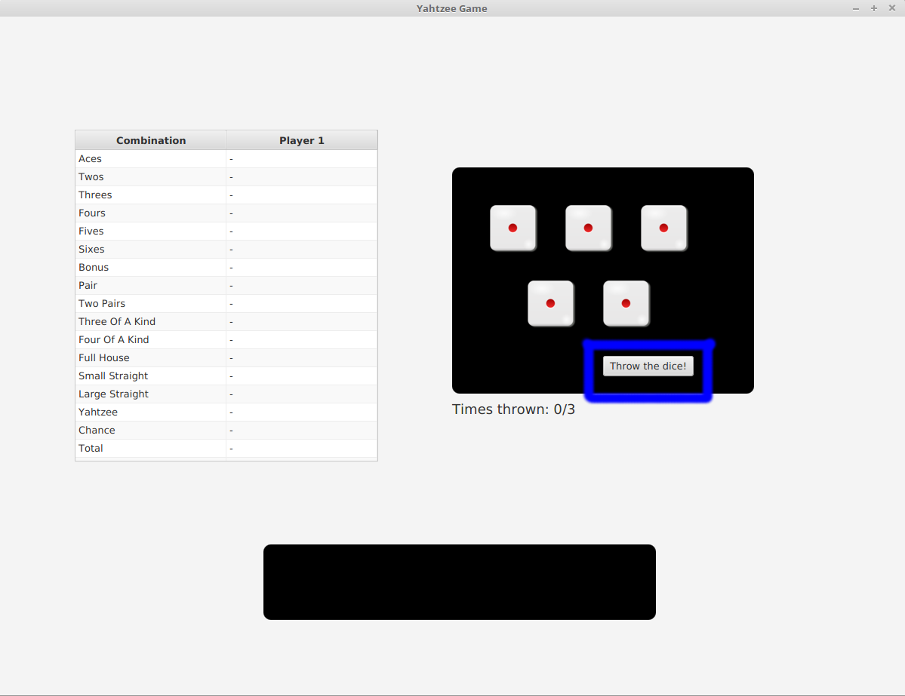
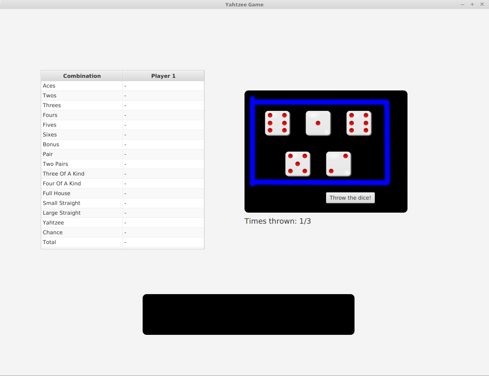
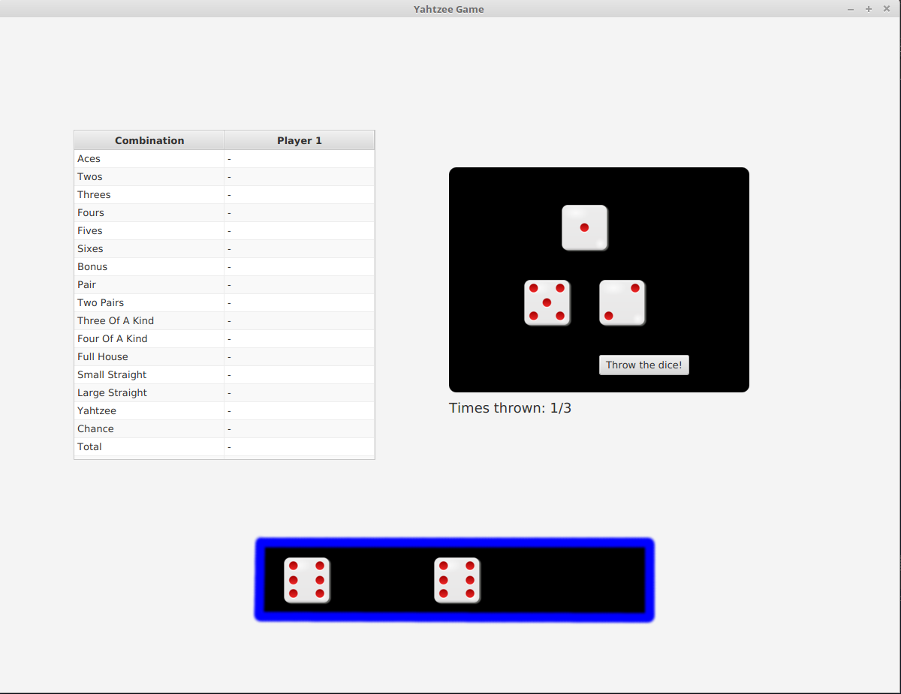
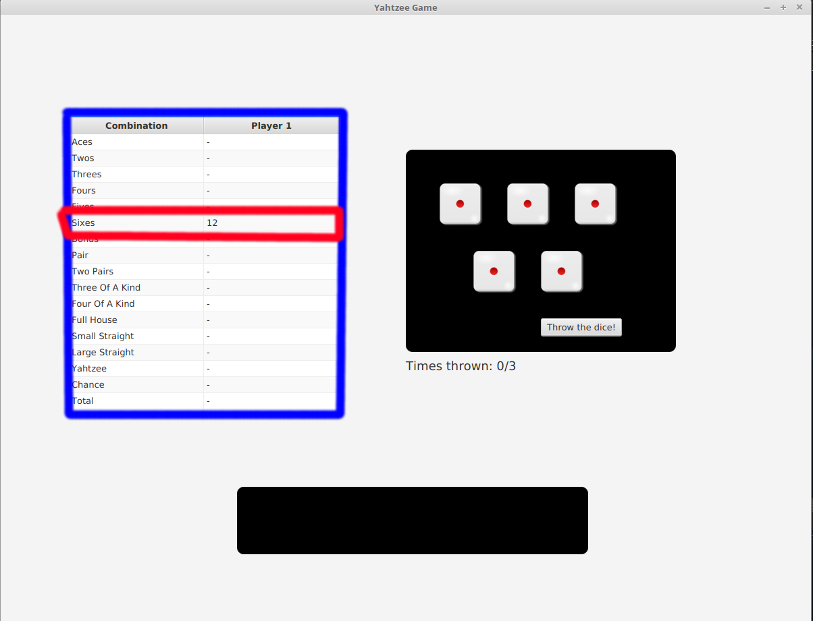
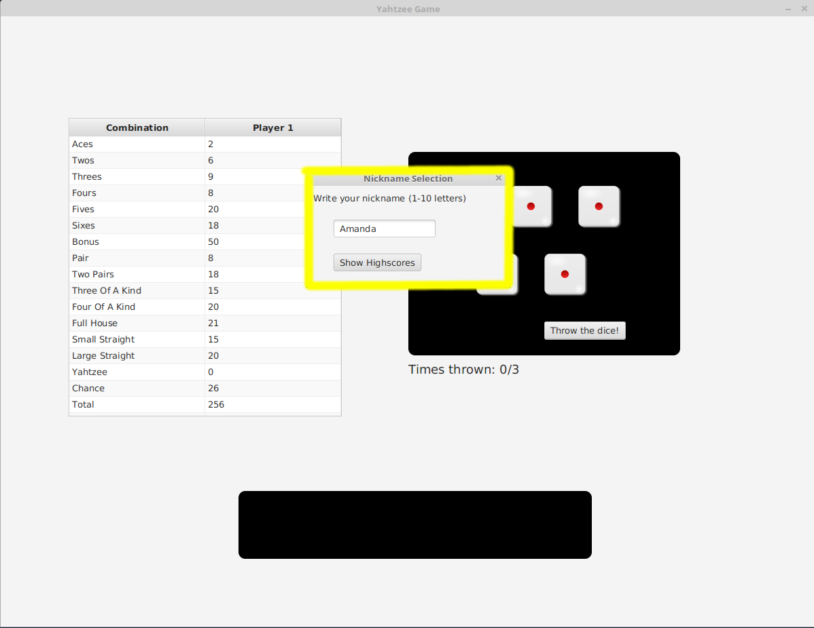
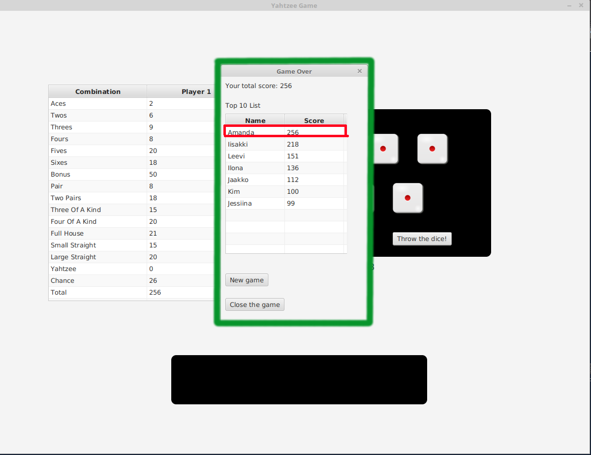

<h1>Käyttöohje</h1>

Lataa tiedoston Yahtzee.jar uusin versio [täältä](https://github.com/rpulkka/otm-harjoitustyo/releases)

<h2>Ohjelman käynnistäminen</h2>

HUOM! Jotta ohjelma toimisi oikein, tietokoneellasi on oltava asennettuna SQLite tietokantajärjestelmä, sillä
ohjelma käsittelee tietokantoja.

Huomaa myös, että ohjelma tallentaa tietokantansa itse tekemäänsä kansioon nimeltään db.

Ohjelma käynnistetään komennolla:

```
java -jar Yahtzee.jar
```
Tai voit myös yksinkertaisesti tuplaklikata lataamasi .jar tiedoston kuvaketta.

<h2>Nopan heittäminen</h2>

Ohjelman käynnistyttyä sinulle avautuu alla olevan kuvan mukainen näkymä. Heittääksesi noppia, sinun tulee painaa
kuvassa sinisellä ympäroityä painiketta "Throw the dice!". 



Seuraavassa kuvassa nappia on painettu ja sinisellä ympyröidyn heittoalueen noppien silmäluvut ovat vaihtuneet heiton 
seurauksena. Huomaa myös heittoalueen alla olevan "Times thrown" tekstin vieressä olevan heittolaskurin arvon
muuttuminen. Sinulla on yhdessä vuorossa kolme mahdollista heittokertaa, joista voit käyttää 1-3 heittoa valintasi
mukaan.



<h2>Nopan valitseminen</h2>

Voit siirtää haluamasi nopat aina kunkin heiton jälkeen kombinaatioalueelle, joka on ympyröitynä alla olevaan kuvaan.
Tämä tapahtuu klikkaamalla haluamaasi noppaa heittoalueella (ympyröity aikaisemmassa kuvassa).


<h2>Kombinaatiot</h2>

Kombinaatioalueelle siirretyistä nopista on tarkoitus muodostaa kombinaatiota. Alle on listattu kaikki
pisteytettävät kombinaatiot Yatzy pelissä. [Wikipedia](https://fi.wikipedia.org/wiki/Yatzy)

---
Tulostaulukon yläosan yhdistelmät:

    Aces: tavoite on saada 1–5 kappaletta 1-silmälukuja, pisteet ovat oikeiden 1-silmälukujen summa
    Twos: tavoite on saada 1–5 kappaletta 2-silmälukuja, pisteet ovat oikeiden 2-silmälukujen summa
    Threes: tavoite on saada 1–5 kappaletta 3-silmälukuja, pisteet ovat oikeiden 3-silmälukujen summa
    Fours: tavoite on saada 1–5 kappaletta 4-silmälukuja, pisteet ovat oikeiden 4-silmälukujen summa
    Fives: tavoite on saada 1–5 kappaletta 5-silmälukuja, pisteet ovat oikeiden 5-silmälukujen summa
    Sixes: tavoite on saada 1–5 kappaletta 6-silmälukuja, pisteet ovat oikeiden 6-silmälukujen summa
    
Tulostaulukon alaosan yhdistelmät:

    Pair: kaksi kappaletta samaa silmälukua, esimerkiksi 1+3+4+5+5 = 5+5 = 10 pistettä
    Two Pairs: kaksi eri paria, esimerkiksi 1+3+3+5+5 = 3+3 ja 5+5 = 16 pistettä, esim. 1+4+4+4+4 ei kelpaa.
    Three of a Kind: kolmessa nopassa sama silmäluku, esimerkiksi 2+4+4+4+5 = 4+4+4 = 12 pistettä
    Four of a Kind: neljässä nopassa sama luku, esimerkiksi 2+3+3+3+3 = 3+3+3+3 = 12 pistettä
    Small straight: viidessä nopassa silmäluvut 1+2+3+4+5 = 15 pistettä
    Large straight: viidessä nopassa silmäluvut 2+3+4+5+6 = 20 pistettä
    Full House: yksi pari ja yksi kolmoisluku, esimerkiksi 3+3+6+6+6 = 24 pistettä
    Chance: Silmälukujen summa. Hyödyllinen, jos pelaaja ei saa mitään jäljellä olevaa yhdistelmää.
    Yahtzee: kaikissa viidessä nopassa sama silmäluku: aina 50 pistettä.
---

<h2>Pisteytys</h2>

Kerättyäsi johonkin kombinaatioon vaadittavat nopat kombinaatioalueelle (aiemmassa kuvassa) voit pisteyttää
kombinaatiosi klikkaamalla tulostaulusta (ympäröity alla olevassa kuvassa sinisellä) haluamaasi kombinaatiota
vastaavaa riviä, joka on esimerkissämme Sixes eli kuutoset (ympyröity vihreällä). Tällöin sarakkeen arvo
päivitetään kombinaation pisteytyksen mukaan, niin että kombinaatiosta saadut pisteet näkyvät rivin oikeassa
sarakkeessa. Pisteytyksen myötä uusi kierros alkaa ja nopat siirtyvät takaisin heittoalueelle ja uusi kierros
pelataan noudattamalla samoja sääntöjä kuin pelaamamme esimerkkikierros. 



<h2>Pelin kulku</h2>

Aiemmin mainittu mahdollisten
kombinaatioiden lista jakautuu "ylä- ja alaosan" yhdistelmiin, jotka viittaavat siihen, että yläosan, eli bonus
-kentän yllä olevat kombinaatiot on pisteytettävä ensin, jonka jälkeen jaetaan 50 pisteen bonus niille pelaajille,
jotka saivat yläosan yhdistelmistä väh. 63 pistettä. Tämän jälkeen aletaan täyttää tulostaulukon alaosan
yhdistelmiä, kunnes kaikki yhdistelmät on pisteytetty ja Total kenttään lasketaan pisteiden yhteissumma. Pelin 
tarkoitus on saada suurin yhteissumma, eli Total. Huomaa, että joka vuorolla on pisteytettävä, jokin kombinaatio,
vaikka minkään kombinaation ehdot eivät täyty, jolloin tälle riville kirjataan 0 pistettä. Muista myös, että
kombinaatioalueella on oltava väh. 1 noppa, jotta kombinaatio voidaan pisteyttää, vaikka minkään kombinaation 
ehdot eivät täyttyisi.

<h2>Nimimerkin valinta</h2>

Mikäli pääset kymmenen parhaan listalle paikallisesti, sinulle avautuu alla olevassa kuvassa esitetty ikkuna. 
Saat tällöin kirjoittaa tekstikenttään haluamasi nimimerkin (1-10 merkkiä), jonka jälkeen painetaan ikkunan
pohjalla olevaa "Show Highscores" painiketta, jolloin pääset tarkastelemaan paikallista ennätystaulua. Jos et
päässyt kymmenen parhaan joukkoon, sinulle ei näytetä nimimerkin valinta -valikkoa vaan siirryt automaattisesti
tarkastelemaan ennätysvalikkoa.



<h2>Ennätykset ja pelistä poistuminen</h2>

Pelin lopuksi avautuu alla esitetty ikkuna. Ylhäällä oleva teksti kertoo paljonko pisteitä sait pelissä. 
Ennätystaulussa puolestaan on listattu 10 parasta paikallista tulosta. Jos pääsit kymmenen joukkoon niin myös
sinun nimimerkkisi on listassa. Vasemmassa sarakkeessa on ennätyksen tekijän nimimerkki ja oikealla pisteet.
Alla olevaa "New game" -nappia painamalla voit aloittaa uuden pelin, kun taas "Close the game" -painike sulkee
pelin. 


