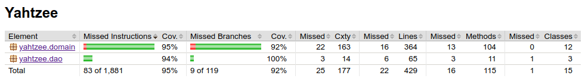

<h1>Testausdokumentti</h1>

Ohjelma on testattu käyttäen automaattisia JUNIT yksikkö- ja integraatiotestejä, sekä ohjelma on kokeiltu ladata ja
testata sen toimintaa järjestelmätasolla manuaalisesti.

<h2>Yksikkö- ja integraatiotestaus</h2>

<h3>Sovelluslogiikka</h3>
Sovelluslogiikan testaus koostuu integraatiotestistä CombinationManagerTest.java, joka testaa CombinationManager 
-luokkaa sekä samalla kaikkia kombinaatioita käsitteleviä luokkia, sekä yksikkötesteistä DieTest.java ja 
DiceThrowerTest.java, jotka testaavat nimiensä mukaisia luokkia. CombinationManagerTest muodostaa yksin suurimman
osan testeistä ja sen tärkeimpiä testejä ovat testit, jotka kokeilevat pisteytystä eri nopilla tarkistaen
pisteytetäänkö ne oikein. Nämä testit ovat nimetty käyttäen nimenä scoresCombination, 
wontScoreCombinationWithoutReason, moreThanCombinationCountsAsCombination, missä combination on tietenkin testattavan
kombinaation nimi.

<h3>DAO -luokat</h3>
DAO -luokka on testattu luomalla tilapäinen test.db tiedosto helpottamaan DAO:n testausta. Tämä tapahtuu luomalla
kyseinen tiedosto avaamalla siihen yhteys ja testien lopuksi poistamalla tiedosto File.delete() metodilla. DAO 
-luokan testiluokka on integraatiotesti DaoTest.java.

<h3>Testikattavuus</h3>
Käyttöliittymäluokkia lukuunottamatta sovelluksen testauksen rivikattavuus on 95% ja haarautumakattavuus 92%.

Testaamatta jäi mm. kombinaatioita käsittelevien luokkien yksikkötestaus.

<h2>Järjestelmätestaus</h2>

Sovelluksen järjestelmätestaus on suoritettu manuaalisesti.

<h3>Asennus ja konfigurointi</h3>

Ohjelman Final Release on ladattu kahdella tietokoneella ja sitä on testattu tilanteissa, joissa tietokanta on
jo olemassa, sekä tilanteissa joissa ohjelma luo sen itse. Windows koneellani, johon ei oltu asennettu SQLite:ä
tietokannat eivät toimineet, josta tein johtopäätöksen, että SQLite on vaatimuksena ohjelman käyttöön. Linux
fuksiläppäri onnistui suoritttamaan ladatun ohjelman oikein valmiin tietokannan kanssa ja ilman.

<h3>Toiminnallisuudet</h3>

Kaikkia [määrittelydokumentin](https://github.com/rpulkka/otm-harjoitustyo/edit/master/dokumentaatio/testaus.md)
ja [käyttöohjeen](https://github.com/rpulkka/otm-harjoitustyo/edit/master/dokumentaatio/testaus.md) toimintoja on
testattu ja todettu toimiviksi. Nimimerkin valintakenttään on yritetty syöttää liian pitkiä ja lyhyitä 
nimimerkkejä ja olemattomia kombinaatioita on yritetty pisteyttää sekä noppia on yritetty valita ennen heittoja
tuloksetta, joten ohjelma näyttäisi toimivalle.

<h2>Sovellukseen jääneet laatuongelmat</h2>

Sovellus ei toimi ilman SQLite:ä.

Lisäksi on ikävää, että esim. nimen valintaikkunasta voi poistua painamalla ikkunan x -painiketta, eikä lisättyä
painiketta, jolloin pääsee takaisin peli-ikkunaan, mutta peli on jo pelattu, eikä ohjelma tee virheilmoitusta.

Nimen valinnassa voisi olla tarkemmat rajat siitä, mitä merkkejä saa käyttää, jotta nimimerkit ovat aina
mielekkäitä lukea. Vastuu jää nyt käyttäjälle.
