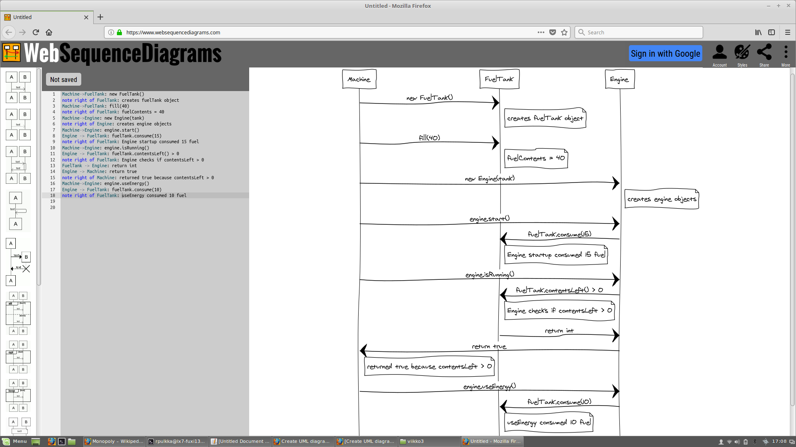

<h1>Kolmannen viikon tehtävät</h1>

<h3>Huom: Kannattaa klikata kuvaa, jolloin pääsee kuvan tallennusosoitteeseen ja sitten kannattaa raahata kuva hiirellä selaimen uudeksi tabiksi, jotta kuva näkyy paremmin.</h3>

T1:

T2:

T3:

<h3>Huom! Tehtävä neljä piti jakaa kahteen kuvaan, sillä se ei mahtunut ruudulle kokonaan!</h3>

T4 (ensimmäinen kuva):

T4 (toinen kuva):

     
